# Seam Carving

### Table of Contents

1. [Introduction](#introduction)
2. [Algorithmic aspect](#algorithmic-aspect)
3. [Some interesting results](#some-interesting-results)
4. [A demo web app](#a-demo-web-app)
5. [Project setup](#project-setup)

## Introduction

Seam carving, known also as liquid rescaling, is an algorithm for 'content-aware' image resizing. The algorithm is developed by S.Avidan and A.Shamir. The main idea is to resize an image (thus reduce the image size) by removing the _least noticeable_ pixels and thus preserving the context. The idea is implemented by defining a suitable _energy_ metric for each pixel and then find a consecutive horizontal (or vertical) path of the _least energy_. That path is named as seam and that seam will be removed in the process of resizing.

The motivation and intuition behind is well [explained in this video](https://www.youtube.com/watch?time_continue=31&v=6NcIJXTlugc&feature=emb_logo).

The algorithm is surprisingly simple, but remarkably elegant:

1. Calculate the energy metric of each pixel.
   There are numerous methods covering this topic. The most popular approaches are **gradient magnitude**, **entropy**, **visual saliency map**, **eye-gaze movement**... I have chosen to approximate **gradient magnitude** by using a well known convolution **Sobel operator (3x3)**. This is a discrete differentiation operator usually used as a step in edge detection problem. [Learn more about Sobel here](https://en.wikipedia.org/wiki/sobel_operator)
2. Having computed the energy metric, find the lowest energy horizontal or vertical path - seam.
   This problem can be reduced to the shortest path problem which is solvable by many graph algorithms (Dijkstra's algorithm, Bellman-Ford...), but there is a beautiful and optimal dynamic programming solution.
   It is interesting to note I have recently encountered [a surprisingly similar programming interview problem](https://leetcode.com/problems/minimum-path-sum/) solving exactly 'the lowest energy' problem.
3. Remove the lowest energy seam from the image

Although S.Avidan and A.Shamir present various interesting applications of the seam carving, including object removal, image enlarging and content amplification, I have chosen to implement only the simplest operation - image resizing. However, object removal can be reduced to the problem of image resizing and I will consider this feature in future.

Link to the original research paper: [Seam carving for content-aware image resizing](https://dl.acm.org/doi/10.1145/1275808.1276390)

## Algorithmic aspect

Complete algorithm implementation is [here](https://github.com/gboduljak/seam-carving/blob/master/api/algorithm.py).

### Energy computation

S.Avidan and A.Shamir stress the importance of energy function on the 'quality' of seams chosen. It is surprising that a very simple gradient magnitude often gives satisfactory results. I have decided to implement a similar function, with a bit of preprocessing.

In terms of the implementation, I have decided to use **scipy's** built in **convolve2d** which did a great job.

Prior to any computation, we convert the original image into grayscale. Since the small (3x3) Sobel kernel is susceptible to noise, I have decided to apply the small amount of Gaussian blur prior to the application of the Sobel operator. It is interesting to see that such a simple method gives generally satisfactory results.

The implementation is given below:

```python
sobel_kernels = {
    'x': array([
        [-1, 0, 1],
        [-2, 0, 2],
        [-1, 0, 1]
    ]),
    'y': array([
        [1, 2, 1],
        [0, 0, 0],
        [-1, -2, -1]
    ])
}

gaussian_kernel = (1/16) * array([
    [1, 2, 1],
    [2, 4, 2],
    [1, 2, 1]
])

def apply_sobel(image: array):
    blurred = convolve2d(image, gaussian_kernel, mode='same', boundary='symm')
    grad_x = convolve2d(
        blurred, sobel_kernels['x'], mode='same', boundary='symm')
    grad_y = convolve2d(
        blurred, sobel_kernels['y'], mode='same', boundary='symm')
    grad = sqrt(grad_x * grad_x + grad_y * grad_y)
    normalised_grad = grad * (255.0 / max(grad))
    return normalised_grad

```


<br/>
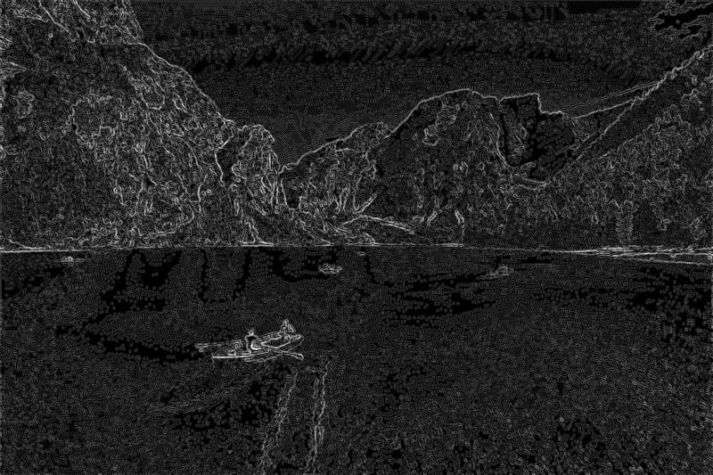
The results of applying Sobel operator to the original image.
<br/>

### The optimal seam algorithm

For the sake of simplicity, we will consider only vertical seams in this discussion. By the symmetry of the problem, we can argue in this way.

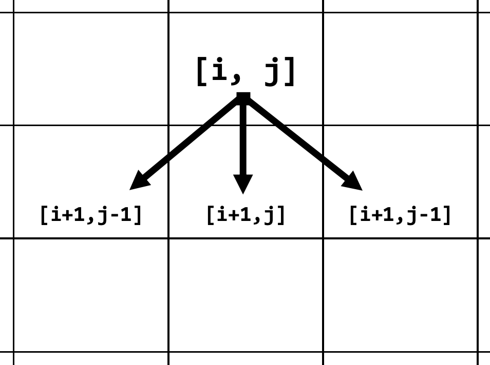

We can solve the seam computation problem using dynamic programming due to an important characteristic of the problem:

- **Optimal substructure**

  - We observe that the least energy seam from the some row of the picture to the last row must contain the least energy seam starting from some position in the next row and ending somewhere in the last row.

  - **Claim**: Let p be the optimal seam starting from the position dp(i)(j) ending somewhere in the last row. For the sake of simplicity, assume that all three direct neighbours of dp(i)(j) shown above exist and they are in the image (we restrict neighbours as in the figure above). Assume, without loss of generality, that a next point in **p** is (i+1,j). Then a path **p'** starting from (i + 1, j) and ending somewhere in the last row must be a lowest energy path from (i + 1, j).

    - **Proof**: (By contradiction)

      Assume, for the sake of contradiction, that there exists a path **v'** starting from (i + 1, j) and ending somewhere in the last row but having the smaller energy than the path **p**. Now consider the path **w** starting from (i, j) and continuing from **v'**. Since **v'** has smaller energy than **p'**, we have that the energy of **w** is smaller than the energy of **p** and they both start from the same point (i, j). This contradicts the optimality of **p**. Therefore **p'** must be a lowest energy path from (i + 1, j). This completes the proof.

- **Naive recursive solution**

  - By the optimal substructure above, we know we can correctly determine the optimal seam from starting from (i,j) by considering all possible 'extensions' of a path starting from (i, j) and there are finitely many of them (at most 3). By examining all of them, we obtain a natural recursive solution of the problem which is optimal by exhaustion.

  - Let `dp[i][j]`be the cost of the least energy seam starting from the pixel at (i, j). Let `e[i][j]`be the energy of a pixel at position (i, j). Let m be the number of rows. Then

    

- **Overlapping subproblems**

  - By inspection of the recursion tree obtained from the recursion above, we observe that many subproblems are overlapping. Moreover, they can be solved independently and only once.
  - Along with the **Optimal substructure**, this property allows us to safely apply dynamic programming paradigm and we can implement the recursion above in either top-down or bottom-up way. Since images can be possibly large and Python does not handle 'deep' recursion very well, it is reasonable to pick bottom-up implementation.

Apart from just computing `dp[i][j]`for every subproblem, we store a choice made where to extend the path in `next_seam_position[i][j]`. We will use this matrix to reconstruct the optimal seam.

Now, since the topological ordering of problems is very simple, we can translate the above recursive formula into the following bottom-up loop based implementation.

```python
@jit
def compute_optimal_seam(energy):
    rows, cols = energy.shape
    infinity = maxsize / 10
    dp = energy.copy()

    next_seam_position = zeros_like(dp, dtype=numpy.intp)

    for col in range(cols):
        dp[rows - 1][col] = energy[rows-1][col]

    for row in range(rows - 2, -1, -1):
        for col in range(cols):
            optimal_adjacent_cost = infinity
            optimal_choice = -1
            adjacents = [
                ((row + 1, col - 1), DIAGONAL_LEFT),
                ((row + 1, col), DOWN),
                ((row + 1, col + 1), DIAGONAL_RIGHT),
            ]
            for (adjacent, choice) in adjacents:
                adjacent_row, adjacent_col = adjacent
                if not is_in_image(adjacent, rows, cols):
                    continue
                if dp[adjacent_row][adjacent_col] < optimal_adjacent_cost:
                    optimal_adjacent_cost = dp[adjacent_row][adjacent_col]
                    optimal_choice = choice

            next_seam_position[row][col] = optimal_choice
            dp[row][col] = energy[row][col] + optimal_adjacent_cost

    seam_start_col = argmin(dp[0, :])
    seam_start = (0, seam_start_col)
    seam_cost = dp[0][seam_start_col]
    return (seam_start, seam_cost, next_seam_position)
```

**Informal complexity analysis**

Let m, n be the number of rows and columns in the image matrix respectively. Then the number of distinct sub

There are m \* n subproblems and solving each of those takes constant time. Therefore, both time and space complexity of this algorithm are theta m \* n .

**Seam reconstruction**

Having previously stored all choices made in a solution of each subproblem, we can reconstruct seams 'backwards' iteratively from computed values.

```python
@jit
def trace_seam(mask, original_image, energy_image, seam_start, next_seam_position):
    seam_pos = seam_start
    while True:
        row, col = seam_pos
        mask[row][col] = 0
        original_image[row][col] = (255, 0, 0)
        energy_image[row][col] = (255, 0, 0)
        if (next_seam_position[row][col] == 0):
            break
        if (next_seam_position[row][col] == DIAGONAL_LEFT):
            seam_pos = (row + 1, col - 1)
        elif (next_seam_position[row][col] == DIAGONAL_RIGHT):
            seam_pos = (row + 1, col + 1)
        else:
            seam_pos = (row + 1, col)

```

As we iterate through the seam, we can mark the seam pixels in the original image and energy map to obtain visualisations such as:

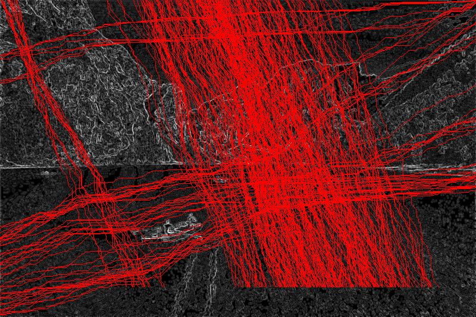

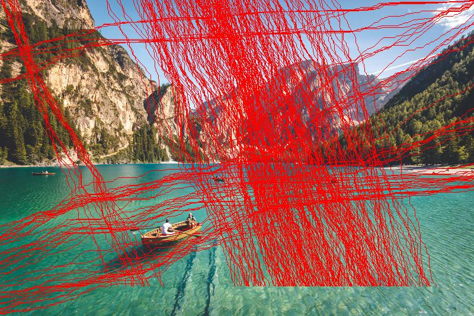

As a side note, I have decided to experiment with [Numba](http://numba.pydata.org/) library used to accelerate CPU intensive calculations by precompiling Python into a native code. I have observed at least 30% speedup in compute optimal seam computation but I had to sacrifice a bit on the side of code readability. Hence the algorithm implemented is possibly not the most _pythonic_.

## Some interesting results

### Successfull

#### Mountains

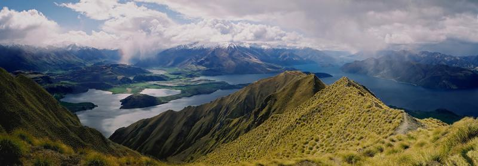

**original**

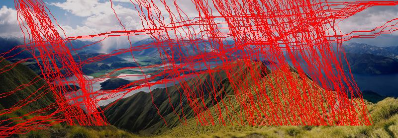

**seams**

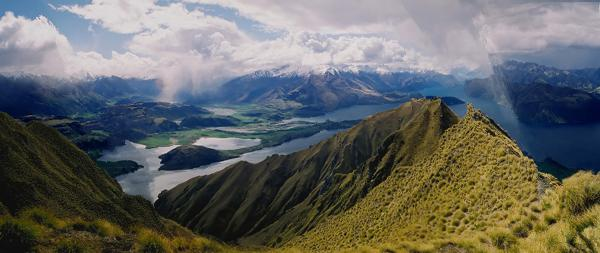

**resized with seam carving**

#### Lake


**original**

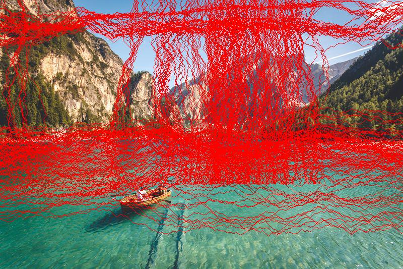

**seams**


**resized with seam carving**

### Failures

#### Basketball

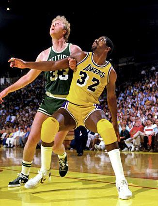

**original**

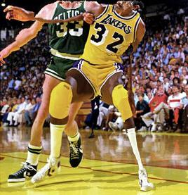

**resized with seam carving**

#### Mona Lisa

The image environment is completely distorted, but the mysterious face still remains (almost) intact.

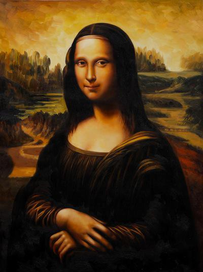

**original**

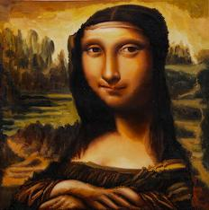

**resized with seam carving**

## A demo web app

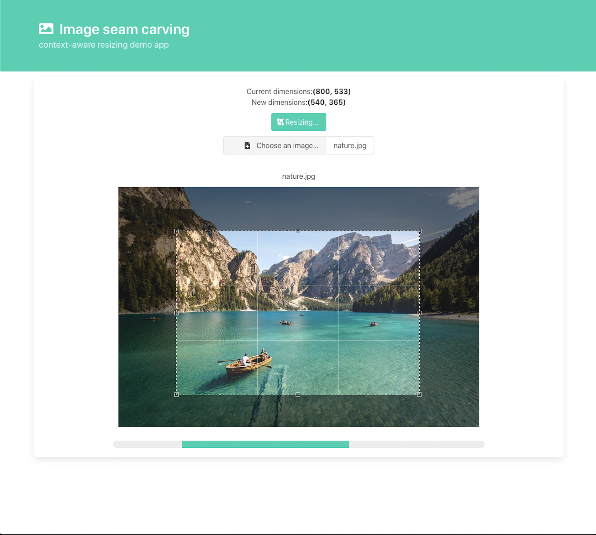
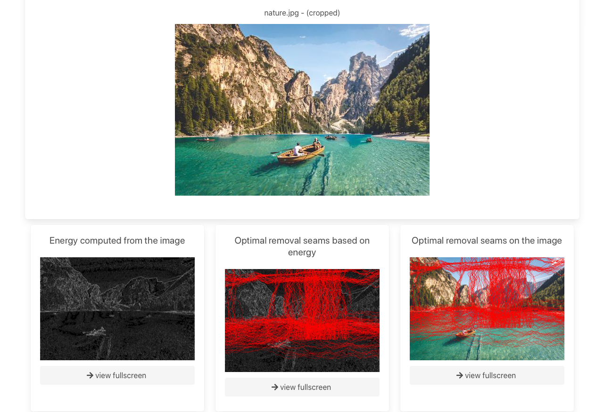

There are two projects required to run a demo app:

- **api**
  - This is a simple rest api exposing the resizing algorithm through REST endpoint /resize. The framework used to build it is Flask.
- **web**
  - This is a demo application written in React. It communicates with the api and all resizing is done one the server side.
  - It is used to select an image and choose new dimensions. After that application sends the request to the api which does the processing. It is possible to view the cropped image, energy map and computed seams for every image.

## Project setup

It is required to have Python3 (either virtualenv, pyenv or globally) and node installed.

1. Run setup.sh which installs all required packages and does environment setup for both api and web.
2. Run run_api.sh which runs the api in development environment.
3. Run run_web.sh which runs the web in development environment.
4. Do some seam carving :)
